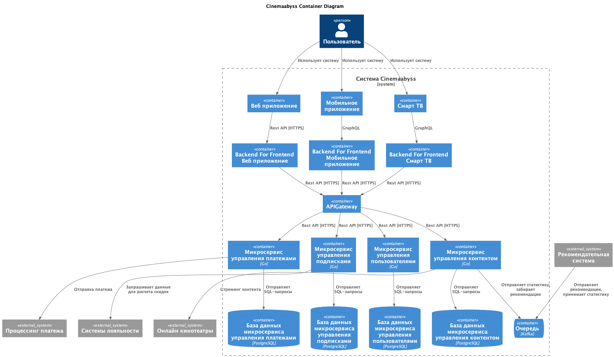
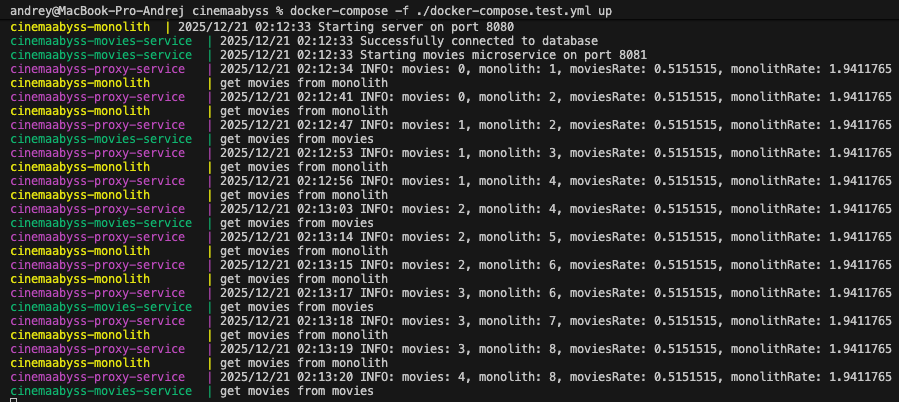
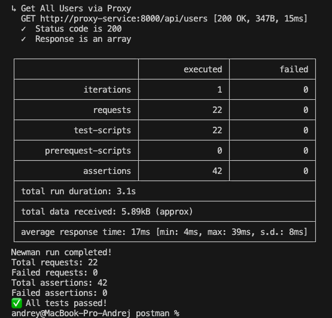
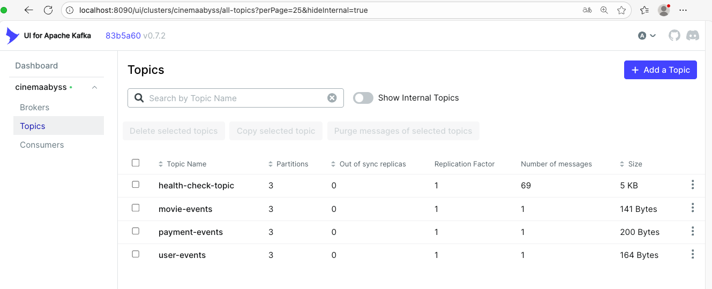
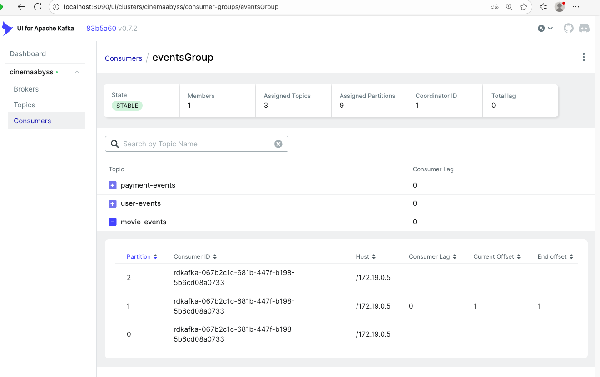
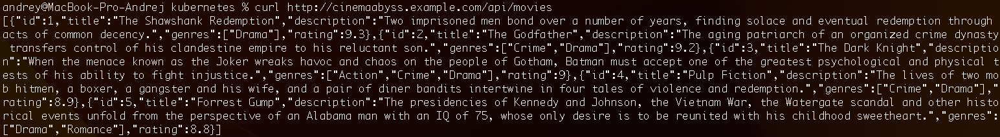
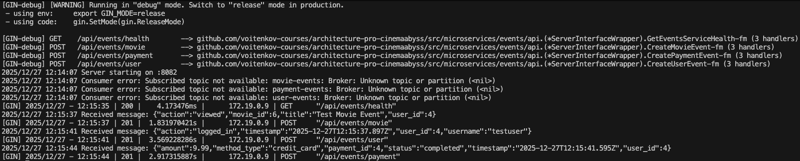
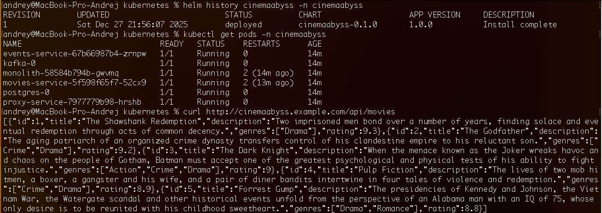
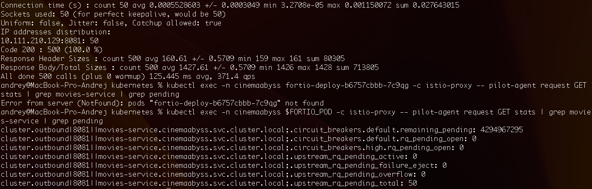

# Cinemaabyss

## Задание 1. Проектирование архитектуры

### 1. Определение доменов и контекстов

Домен: управление платежами
- контекст: обработка транзакций
- контекст: ведение журнала транзакций

Домен: управление пользователями
- контекст: профили пользователей
- контекст: аутентификация пользователей

Домен: управление контентом
- контекст: доставка контента 

Домен: управление подписками
- контекст: управление подписками
- контекст: управление скидками

### Определение микросервисов

* Управление платежами
	* Микросервис управления платежами
		- контекст: обработка платежей
		- контекст: журнал платежей
* Управление пользователями  
	* Микросервис управления пользователями
		- контекст: профили пользователей  
		- контекст: аутентификация пользователей
* Управление контентом 
  * Микросервис управление контентом
    - контекст: каталог контента
    - контекст: поиск контента
    - контекст: просмотр контента   
* Управление подписками
  * Микросервис управления подписками
    - контекст: управление подписками
    - контекст: управление скидками

## Описание архитектуры согласно модели C4

**Диаграмма контейнеров (Containers)**



## Задание 2

### 1. Proxy

[x] Proxy-service разработан и успешно запущен через docker-compose.  
[x] Postman-тесты пройдены успешно (кроме Events).  
[x] Протестирован постепенный переход, изменяя переменную окружения MOVIES_MIGRATION_PERCENT в файле docker-compose.yml.  

для MOVIES_MIGRATION_PERCENT = 34, на 3 запроса 1 должен уходить в Movies-service, а 2 в Monolith. Проверяем:
```
curl http://localhost:8000/api/movies
[{"id":1,"title":"The Shawshank Redemption","description":"Two imprisoned men bond over a number of years, finding solace and eventual redemption through acts of common decency.","genres":["Drama"],"rating":9.3},{"id":2,"title":"The Godfather","description":"The aging patriarch of an organized crime dynasty transfers control of his clandestine empire to his reluctant son.","genres":["Crime","Drama"],"rating":9.2},{"id":3,"title":"The Dark Knight","description":"When the menace known as the Joker wreaks havoc and chaos on the people of Gotham, Batman must accept one of the greatest psychological and physical tests of his ability to fight injustice.","genres":["Action","Crime","Drama"],"rating":9},{"id":4,"title":"Pulp Fiction","description":"The lives of two mob hitmen, a boxer, a gangster and his wife, and a pair of diner bandits intertwine in four tales of violence and redemption.","genres":["Crime","Drama"],"rating":8.9},{"id":5,"title":"Forrest Gump","description":"The presidencies of Kennedy and Johnson, the Vietnam War, the Watergate scandal and other historical events unfold from the perspective of an Alabama man with an IQ of 75, whose only desire is to be reunited with his childhood sweetheart.","genres":["Drama","Romance"],"rating":8.8}]
```


### 2. Kafka

[v] MVP сервиса Events разработан.  
[v] Реализовано взаимодействие через Apache Kafka.  
[v] Все тесты проходят успешно.  





## Задание 3

[v] реализовать CI/CD для сборки прокси сервиса
[v] реализовать необходимые конфигурационные файлы для переключения трафика.

### CI/CD

[v] сборка отработала и в github registry появятся ваши образы
[v] "зеленая" сборка и "зеленые" тесты

### Proxy в Kubernetes

[v] Все микросервисы успешно задеплоены в Kubernetes
[v] Ingress работает, API микросервисов доступно
[v] Тесты успешно проходят
[v] Выполняется обмен сообщениями через Kafka




## Задание 4

[v] Реализован Helm-чарт для всех сервисов.  
[v] Микросервисы установлены при помощи Helm-чарта.  
[v] Ingress работает, API микросервисов доступно.  



# Задание 5

[v] Развернул Istio.   
[ ] Настроил Cicuit Breaker (не обнаружил .\src\kubernetes\circuit-breaker-config.yaml).  
[v] Прогнал тесты с использованием Fortio (но без Circuit Breaker).  


